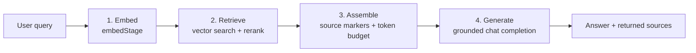

# Query-to-answer RAG pipeline

## Stage responsibilities

1. **Embed**: `embedStage` sends the user query to the configured embedding model and returns the query vector.
2. **Retrieve**: `retrieveStage` searches the vector store for candidate chunks, reranks them with lexical relevance, and keeps the final top `k` chunks.
3. **Assemble**: `assembleStage` adds `[1]`, `[2]` source markers and filenames, applies grounding instructions, and reserves output tokens inside the model context window.
4. **Generate**: `generateStage` sends the assembled prompt to the chat model at temperature `0`, then returns the generated answer and model usage.
5. **Return**: `runRagPipeline` exposes the answer, selected source markers, and per-stage evidence for inspection.

If retrieval returns no chunks, assembly uses its explicit `No retrieved context was provided.` fallback. Generation is still safe because the prompt instructs the model to say that the context is insufficient rather than inventing an answer. A production API can instead short-circuit before generation and return an `insufficient_context` status.

Run the offline end-to-end sample with `npm run pipeline:sample`.